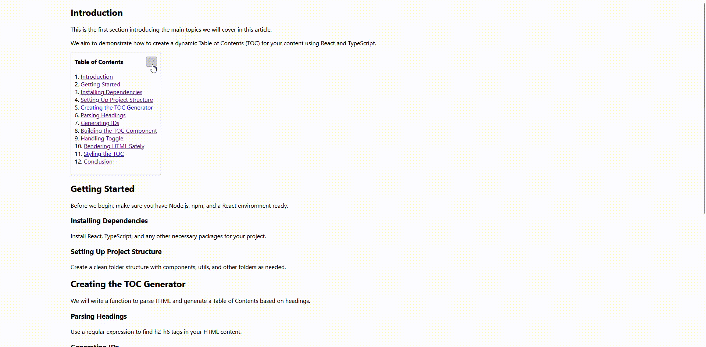

# react-toc-builder

[](https://www.npmjs.com/package/react-toc-builder)
[](https://www.npmjs.com/package/react-toc-builder)
[](https://www.npmjs.com/package/react-toc-builder)
[](https://opensource.org/licenses/MIT)

A lightweight and customizable Table of Contents (TOC) generator for React applications. Automatically scans HTML content for headings (h2–h6) and injects a collapsible, stylized TOC with support for custom icons and styling.

## 🎬 Demo

<p>
  
</p>

## ✨ Features

- 🚀 **Lightweight**: Minimal bundle size with zero dependencies
- 🎨 **Customizable**: Full control over styling and appearance
- 📱 **Responsive**: Works seamlessly across all device sizes
- 🔧 **Flexible**: Configurable position, icons, and behavior
- ⚡ **Fast**: Efficient DOM scanning and TOC generation
- 🎯 **Accessible**: Built with accessibility in mind

## 📦 Installation

```bash
npm install react-toc-builder@latest
```

or

```bash
yarn add react-toc-builder@latest
```

## 🚀 Quick Start

```jsx
import React from 'react';
import { generateToc, TocWrapper } from 'react-toc-builder';

const BlogContent = () => {
  const content = `
    <p>Welcome to my blog!</p>
    <h2>Introduction</h2>
    <p>This is the intro.</p>
    <h3>Overview</h3>
    <p>Some overview text.</p>
    <h2>Getting Started</h2>
    <p>Let's dive in!</p>
  `;

  const htmlWithToc = generateToc(content, 1, "/toc-icon.png");

  return <TocWrapper html={htmlWithToc} />;
};

export default BlogContent;
```

## 📘 Using in Next.js or TypeScript Projects

When using this package inside a Next.js or TypeScript project, you may notice two common warnings. First, TypeScript may show: `“Could not find a declaration file for module 'react-toc-builder'”`. Since the package currently does not include built-in type definitions, you can fix this by creating a file named `react-toc-builder.d.ts` in the root of your project and adding `declare module "react-toc-builder";`.This ensures TypeScript understands the module and removes the error.

Additionally, if you are using the Next.js App Router, you might see the message: `“useEffect only works in Client Components`. Add the `"use client"` directive at the top of the file”. This occurs because `TocWrapper` internally uses `useEffect`. To resolve this, make sure that any Next.js component where you use `TocWrapper` includes `"use client"` at the very top of the file. Once these two small adjustments are made, the package works smoothly in both TypeScript and modern Next.js environments.

## 📖 API Reference

### `generateToc(htmlContent, positionAfter, icon)`

Generates a table of contents from HTML content and returns the modified HTML string.

#### Parameters

- `htmlContent` (string): The HTML content to scan for headings
- `positionAfter` (number, optional): Insert TOC after paragraph index (default: 0)
- `icon` (string, optional): Path to custom icon or image URL (default: null)

### `TocWrapper`

React component that renders the HTML content with the generated TOC.

#### Props

- `html` (string): HTML content with embedded TOC (generated by `generateToc`)

## 🎨 Styling

The component uses CSS classes for easy customization:

```css
.rtb-toc {
  /* Main TOC wrapper */
  border: 1px solid #e1e5e9;
  border-radius: 8px;
  margin: 20px 0;
  padding: 16px;
}

.rtb-toc-header {
  /* TOC header section */
  display: flex;
  align-items: center;
  cursor: pointer;
  font-weight: 600;
}

.rtb-toggle-btn {
  /* Toggle button */
  margin-right: 8px;
  transition: transform 0.2s ease;
}

.rtb-toc-list {
  /* List container */
  margin-top: 12px;
  padding-left: 0;
}

.rtb-toc-item {
  /* Each TOC item */
  list-style: none;
  margin: 4px 0;
}

.rtb-toc-item a {
  /* TOC links */
  text-decoration: none;
  color: #0366d6;
}

.rtb-toc-item a:hover {
  text-decoration: underline;
}
```

## 📁 Example Project Structure

```
my-app/
├── public/
│   ├── toc-icon.png
│   └── custom-icon.svg
├── src/
│   ├── components/
│   │   └── BlogContent.js
│   └── App.js
├── package.json
└── README.md
```

## 🔧 Advanced Usage

### Custom Icon Integration

```jsx
const htmlWithToc = generateToc(content, 2, "/assets/toc-icon.svg");
```

### Multiple TOC Instances

```jsx
const Article = () => {
  const [content, setContent] = useState('');

  const addTocToContent = (htmlContent) => {
    return generateToc(htmlContent, 1, "/toc-icon.png");
  };

  return (
    <div>
      <TocWrapper html={addTocToContent(content)} />
    </div>
  );
};
```

## 🤝 Contributing

We welcome contributions! Please see our [Contributing Guide](CONTRIBUTING.md) for details.

### Development Setup

```bash
# Clone the repository
git clone https://github.com/rakeshdhiman644/react-toc-builder.git
cd react-toc-builder

# Install dependencies
npm install

# Build the package
npm run build

# Link for local development
npm link
```

Then in your React app:
```bash
npm link react-toc-builder
```

## 📋 Requirements

- React 17 or higher
- React DOM 17 or higher

## 🐛 Bug Reports

If you find a bug, please file an issue on our [GitHub repository](https://github.com/rakeshdhiman644/react-toc-builder/issues).

## 📄 License

This project is licensed under the MIT License - see the [LICENSE](LICENSE) file for details.

## 🔗 Links

- [NPM Package](https://www.npmjs.com/package/react-toc-builder)
- [GitHub Repository](https://github.com/rakeshdhiman644/react-toc-builder)
- [Documentation](https://github.com/rakeshdhiman644/react-toc-builder#readme)

## 👨‍💻 Author

**Rakesh Dhiman**

- GitHub: [@rakeshdhiman644](https://github.com/rakeshdhiman644)

---

⭐ If you found this package helpful, please give it a star on GitHub!
