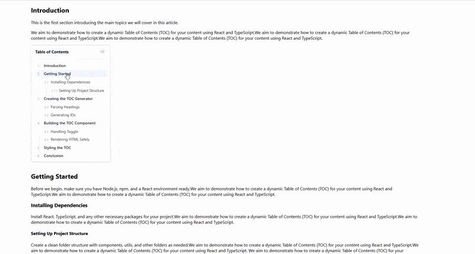

# react-toc-builder

[](https://www.npmjs.com/package/react-toc-builder)
[](https://www.npmjs.com/package/react-toc-builder)
[](https://www.npmjs.com/package/react-toc-builder)
[](https://bundlephobia.com/package/react-toc-builder)
[](https://opensource.org/licenses/MIT)

A lightweight and customizable React Table of Contents generator that automatically creates a nested TOC from HTML headings (`h2–h6`) with smooth styling, collapsible behavior, custom icons, and SSR support.

---

## 🎬 Demo

<p>
  
</p>

---

## ✨ Features

- 🚀 Lightweight and optimized
- 🎨 Fully customizable styling
- ⚡ Fast HTML heading parsing
- 📱 Responsive design
- 🔧 Supports custom icons and SVGs
- 🌐 SSR compatible (Next.js supported)
- 🛡️ DOMPurify-based sanitization
- 🎯 Accessible and keyboard-friendly
- 🧩 Supports nested heading structures (`h2` → `h6`)
- 🔗 Stable SEO-friendly heading IDs

---

## 📦 Installation

```bash
npm install react-toc-builder
```

or

```bash
yarn add react-toc-builder
```

---

## 🚀 Quick Start

```jsx
"use client";

import React from "react";
import {
  generateToc,
  TocWrapper,
} from "react-toc-builder";

const BlogContent = () => {
  const content = `
    <p>Welcome to my blog!</p>

    <h2>Introduction</h2>
    <p>This is the intro.</p>

    <h3>Overview</h3>
    <p>Some overview text.</p>

    <h2>Getting Started</h2>
    <p>Let's dive in!</p>
  `;

  const htmlWithToc = generateToc(
    content,
    1,
    "/toc-icon.png"
  );

  return (
    <TocWrapper html={htmlWithToc} />
  );
};

export default BlogContent;
```

---

## 📘 Next.js & TypeScript Support

### Next.js App Router

`TocWrapper` uses React hooks internally.

If you are using Next.js App Router, add:

```js
"use client";
```

at the top of the component file where you use `TocWrapper`.

---

### TypeScript Support

If TypeScript cannot find module definitions, create:

```bash
react-toc-builder.d.ts
```

and add:

```ts
declare module "react-toc-builder";
```

---

## 📖 API Reference

---

### `generateToc(htmlContent, positionAfter, icon)`

Generates a Table of Contents from HTML content.

#### Parameters

| Parameter | Type | Description |
|---|---|---|
| `htmlContent` | `string` | HTML string containing headings |
| `positionAfter` | `number` | Insert TOC after paragraph index |
| `icon` | `string` | Custom image URL or SVG string |

#### Example

```jsx
const htmlWithToc = generateToc(
  content,
  1,
  "/toc-icon.png"
);
```

---

### `TocWrapper`

React component that safely renders generated TOC HTML.

#### Props

| Prop | Type | Description |
|---|---|---|
| `html` | `string` | Generated HTML from `generateToc()` |

#### Example

```jsx
<TocWrapper html={htmlWithToc} />
```

---

## 🎨 Custom Icons

---

### Image Icon

```jsx
const htmlWithToc = generateToc(
  content,
  1,
  "/assets/toc-icon.png"
);
```

---

### Custom SVG Icon

```jsx
const customIcon = `
<svg
  width="18"
  height="18"
  viewBox="0 0 24 24"
  fill="none"
  stroke="currentColor"
  stroke-width="2"
>
  <polyline points="6 9 12 15 18 9"></polyline>
</svg>
`;

const htmlWithToc = generateToc(
  content,
  1,
  customIcon
);
```

---

## 🎨 Styling

The component uses simple CSS classes for customization.

```css
.rtb-toc {
  border: 1px solid #e1e5e9;
  border-radius: 8px;
  margin: 20px 0;
  padding: 16px;
}

.rtb-toc-header {
  display: flex;
  align-items: center;
  justify-content: space-between;
}

.rtb-toggle-btn {
  cursor: pointer;
}

.rtb-toc-list {
  margin-top: 12px;
  padding-left: 0;
}

.rtb-toc-item {
  list-style: none;
  margin: 4px 0;
}

.rtb-toc-item a {
  text-decoration: none;
  color: #0366d6;
}

.rtb-toc-item a:hover {
  text-decoration: underline;
}
```

---

## 📁 Example Project Structure

```bash
my-app/
├── public/
│   ├── toc-icon.png
│   └── custom-icon.svg
├── src/
│   ├── components/
│   │   └── BlogContent.jsx
│   └── App.jsx
├── package.json
└── README.md
```

---

## 🔧 Advanced Usage

---

### Multiple TOC Instances

```jsx
const addTocToContent = (htmlContent) => {
  return generateToc(
    htmlContent,
    1,
    "/toc-icon.png"
  );
};

<TocWrapper html={addTocToContent(content)} />;
```

---

### Insert TOC at Top

```jsx
generateToc(content, -1);
```

---

### Insert TOC After Second Paragraph

```jsx
generateToc(content, 1);
```

---

## 🔒 Security

`react-toc-builder` sanitizes generated HTML using DOMPurify for safer rendering.

However, for maximum security, it is strongly recommended to sanitize untrusted CMS or user-generated HTML on your backend/server before passing it into `generateToc()`.

---

## 📋 Requirements

- React 17+
- React DOM 17+
- Supports React 19
- Supports Next.js App Router

---

## 🤝 Contributing

Contributions are welcome.

### Development Setup

```bash
git clone https://github.com/rakeshdhiman644/react-toc-builder.git

cd react-toc-builder

npm install

npm run build
```

---

### Local Testing

Inside package folder:

```bash
npm link
```

Inside React app:

```bash
npm link react-toc-builder
```

---

## 🐛 Bug Reports

Found a bug?

Please open an issue on GitHub:

https://github.com/rakeshdhiman644/react-toc-builder/issues

---

## 📄 License

MIT License © Rakesh Dhiman

---

## 🔗 Links

- NPM: https://www.npmjs.com/package/react-toc-builder
- GitHub: https://github.com/rakeshdhiman644/react-toc-builder

---

## 👨‍💻 Author

### Rakesh Dhiman

- GitHub: https://github.com/rakeshdhiman644

---

⭐ If you found this package useful, please consider starring the repository.